# HUMAN ELEPHANT CONFLICT MITIGATION SYSTEM

## Repo Structure

```text
.
├── docs                                        # Documents Folder.
│   ├── github-readme-content                     # Contains GitHub Readme Content.
│   └── project-documentations                    # Contains Project-related Documents.
├── research                                    # Contains Research files
│   ├── 0-project-prototypes                      # Contains project prototypes; Ex: Detection scripts | TFLITE models.
│   └── 1-supporting-scripts                      # Contains frame extractor & night image vision converter scripts.
├── source                                      # Contains Source Code (Main Project Folder)
│   ├── 0-resources                               # Contains resources: database, requirements.yml.
│   ├── 1-hecms-monitoring-system                 # Contains HECMS Monitoring System Project.
│   └── 1-hecms-management-system                 # Contains HECMS Management System Project.
├── test                                        # Contains testing scripts.
│   ├── 0-test-case-for-hecms-monitoring-system   # Contains test caes for HECMS Monitoring System.
│   └── 1-test-case-for-hecms-management-system   # Contains test caes for HECMS Management System.
├── LICENCE                                     # Licence File.
└── README.MD                                   # Readme file.
```

## 01 Introduction

The human-elephant conflict is a persistent issue in Sri Lanka, where elephants are integral to the country's natural beauty and tourism industry. Due to this conflict, several lives and properties have been lost in rural areas of the country. The Sri Lankan government has been using electric fences to prevent elephants from entering villages, but it is unreliable.

An Artificial Intelligence-based Human Elephant Conflict Mitigation System has been developed to address the persistent issue of human-elephant conflict in Sri Lanka. The system employs CCTV cameras and wildlife camera traps to detect elephants in video frames and subsequently sends early warning messages to the corresponding village authorities to take appropriate actions. Furthermore, the system implements external methods, such as artificial sounds of buzzing bees and firecrackers, to discourage elephants from entering village areas.

The system is designed to provide efficient results during the day and nighttime, and it includes features like elephant detection, early warning SMS/email, and a HECMS Management System dashboard. The system also updates the conflict information in the database to be analyzed by the conflicts management team.

The system aims to lead Sri Lankan communities in technology to be more powerful and productive to have beautiful lives for everyone. The ultimate goal of this project is to mitigate human-elephant conflicts and promote a sustainable solution for the issue.

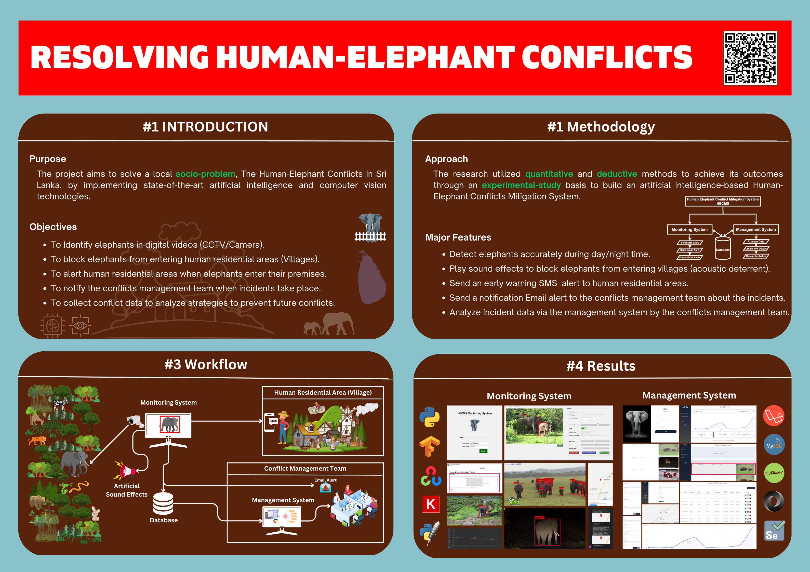

## 02 Technology Stack

### 2.1 Primary Programming Tools

| Programming Tools | Version     | Description                           |
| ----------------- | ----------- | ------------------------------------- |
| **Python**        | Ver: 3.8    | Use to build HECMS Monitoring System. |
| **MySQL**         | Ver: 15.1   | Used as central database.             |
| **Laravel**       | Ver: 10.3.3 | Use to build HECMS Management System. |

### 2.2 Python Dependencies (HECMS Monitoring System)

| Programming Tools   | Version       |
| ------------------- | ------------- |
| **TensorFlow**      | Ver: 2.7.0    |
| **Keras**           | Ver: 2.7.0    |
| **OpenCV**          | Ver: 4.6.0.66 |
| **MySQL Connector** | Ver: 2.2.9    |
| **Pillow**          | Ver: 8.4.0    |
| **Pygame**          | Ver: 2.3.0    |
| **PyShorteners**    | Ver: 1.0.1    |

## 03 System Architecture

This section presents an overview of the system architecture for the Artificial Intelligence-based Human Elephant Conflict Mitigation System. The system architecture comprises various elements, including diagrams, flowcharts, components, UML use-case and class diagrams, ER-Diagrams, etc.

### 3.1 Architecture Diagram

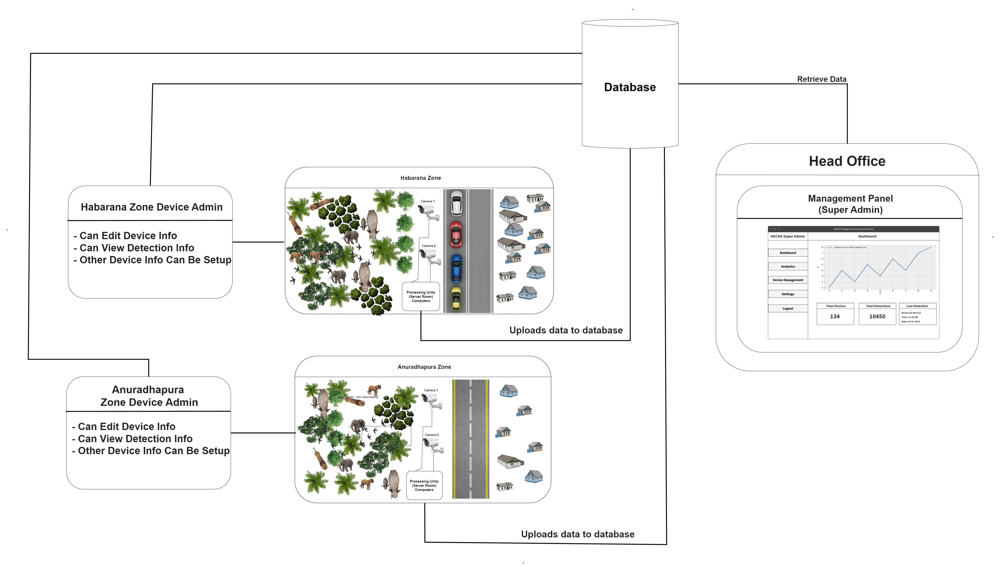

There is a “Head Office” on the right side of the diagram, which means they will use the HECMS Management System, and all the conflict incidents data will be transferred to it and can be analyzed and accessed by the Head Office.

On the left side, there are two zones presented as examples, “Habarana Zone” and “Anuradhapura Zone” (Popular elephant conflict places in Sri Lanka), and each zone has a device admin. That device admin has basic access to the HECMS Management System through the Device Admin account. Each zone has a HECMS Monitoring System installed on a computing device that processes video frames to check elephant presence. If elephants are detected, it will send an SMS to the corresponding villager and an email to “Head Office,” The incident data will be transmitted to HECMS Management System. Those can be accessed by “Head Office” and that device admin.In the middle, the database is shared between Management and HECMS Monitoring Systems to proceed with the granted operations.

### 3.2 Structure Diagram

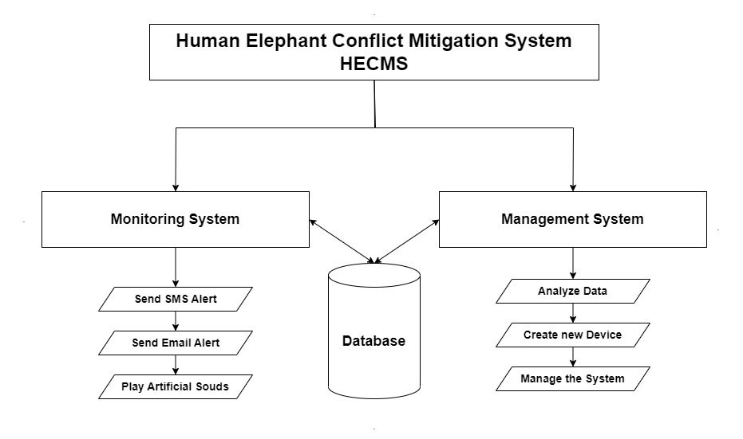

The above structured-based architecture diagram clearly explains how the Human Element Conflict Mitigation System (HECMS) functions structurally. HECMS is divided into two main sub-systems: the HECMS Monitoring System and the HECMS Management System.

Both systems have a shared database in the middle, and their main functionalities are also clearly mentioned; the HECMS Monitoring System’s primary functions are Elephant detection, SMS sending, Email Sending, artificial sound playing, and database updating, and the HECMS Management System’s functions are analyzed data, manage data, and create new devices, etc.

### 3.3 Elephant Detection Process Flowchart

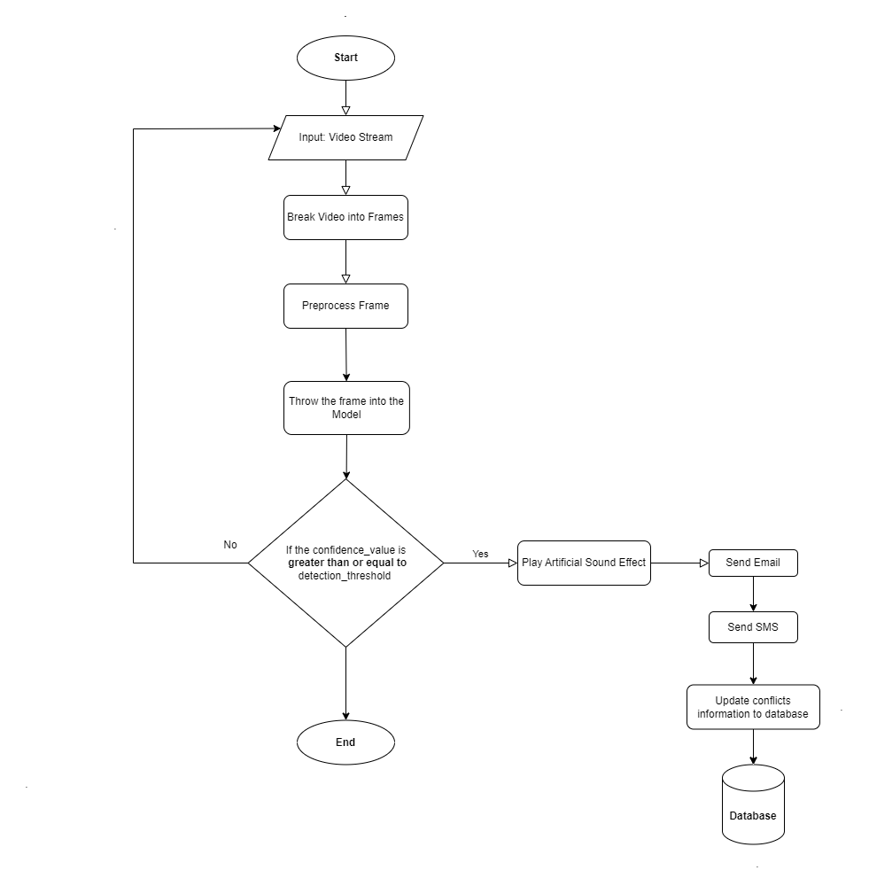

This flowchart explains how the elephant model detection functions. First, it gets the video stream as the input source; then, it will be transmitted to the next layer to break the video into frames. A frame will be sent to the preprocessing unit to clean up, and then inverts the frame into a numerical vector. The frame will be thrown to the neural network for processing, and then it outputs the confidence value; if the confidence value is greater than or equal to the threshold value, it is considered a positive prediction, and then the system will play artificial sound, send SMS, email, and update database; otherwise, the system processes each frame one by one in a looping manner.

### 3.4 ER Diagram


The ER (Entity-Relationship) diagram explains the structure of the database system in a graphical way; it is the visual representation of the database functions, attributes, and relationships between tables.

The above diagram clearly defines three main tables: Device, Data, and User Accounts. The Data table contains detection data, the Device table includes the HECMS Monitoring System’s device data, and the User Account table contains the user account details. This is the shared database utilized by both systems Monitoring and HECMS Management Systems.

### 3.5 Use Case Diagram


The Use Case Diagram is a Unified Modeling Language (UML) behavioral diagram that represents the Elephant Conflict Mitigation System's interactions between users (Super Admin and Device Admin). The Use Case Diagram can illustrate the system's different use cases or functionalities and the users who interact with the system.

### 3.6 Workflow Diagram

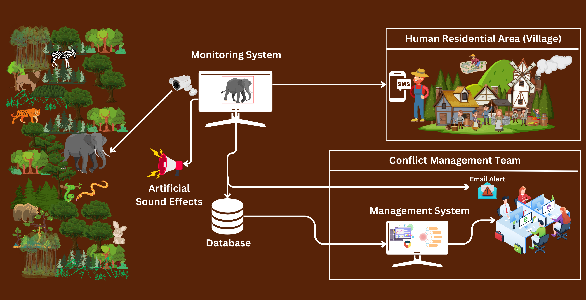

## 04 Setup

This section covers how to set up the human-elephant conflicts mitigation system; this system consists of two main sub-systems: the HECMS Monitoring System and the HECMS Management System. The HECMS Monitoring System is the video processor component that could be installed on a computing device in the jungle to identify elephants; the HECMS Management System is an analytics system used by the conflicts management team to analyze the incident data. This section shows how to install the necessary dependencies to set it up successfully.

### 4.1 Setup HECMS Monitoring System

This project has been designed to operate on both CPU and GPU environments. Utilizing a Graphics Processing Unit (GPU) with CUDA-Enabled technology will enhance the application's performance, allowing faster processing times.

If a GPU is unavailable on the target computer, the system can still be installed and run on the CPU. However, it is essential to note that processing times may be significantly slower when using a CPU than a GPU.

Even though the target computer has a GPU, it is necessary to install CUDA and CUDDN to enable GPU support for TensorFlow. Otherwise, the GPU cannot be utilized but can be run on the CPU.

#### 4.1.1 Installing CUDA & CUDDN (Optional)

It is highly recommended to skip the CUDA & CUDDN installation if the target computer does not have a GPU, as the system can still operate on the CPU. However, it is essential to note that this may result in slower processing times.

Suppose the target computer has a GPU. But if it is chosen not to install CUDA & CUDDN, it is still possible to skip the installation. However, the system can only utilize the CPU power, even though a hardware-based GPU is available. Therefore, CUDA & CUDDN is similar to drivers that enable GPU support.

It is highly recommended to install CUDA & CUDDN if the target computer has a GPU to enable faster processing. The installation steps of CUDA & CUDDN are provided below.

##### Step 01: Checking suitable CUDA & CUDDN verions for TensorFlow.

Check Here:- [https://www.tensorflow.org/install/source#gpu](https://www.tensorflow.org/install/source#gpu)


The system uses TensorFlow version 2.7.0. To successfully install TensorFlow (version 2.7.0), it is necessary first to install CUDA (version 8.1), followed by CUDDN (version 11.2), as indicated in the accompanying chart. Other versions of TensorFlow might be supported. However, version 2.7.0 is highly recommended; it was tested and developed with this version.

It is important to note that the the above chart provides clear instructions on the appropriate versions of CUDA and CUDDN to install for compatibility with the selected version of TensorFlow.

Accordingly, the installation process should commence with the installation of CUDA, followed by the installation of CUDDN, to ensure that the TensorFlow installation is successful and fully compatible with the selected versions of these dependencies.

##### Step 02: Installing CUDA (Ver: 8.1)

Download CUDA From Here:- [https://developer.nvidia.com/cuda-toolkit-archive](https://developer.nvidia.com/cuda-toolkit-archive)


Download and install the appropriate CUDA version from the official website of NVIDIA. The installation process is simple and can be installed with the GUI.


##### Step 03: Installing CUDDN (Ver: 11.2)

Download CUDDN From Here:- [https://developer.nvidia.com/rdp/cudnn-archive](https://developer.nvidia.com/rdp/cudnn-archive)


Download and install the appropriate CUDDN version from the official website of NVIDIA. This time, the installation process could be more challenging.

01.Download and Extract CUDDN zip.

02.There are 3 following folders in it.

```
- bin
- include
- lib
```

03.Open the CUDA Installation directory (WHERE is the CUDA installed) Ex: (C:\Program Files\NVIDIA GPU Computing Toolkit\CUDA\v11.2)


04.Copy all content from "bin", "include", "lib" folders from the extracted CUDDN zip to the installed CUDA directory's bin, include, lib. An example is shown above.

##### Step 04: Add CUDA & CUDDN Path to the environment variable.

After successfully installing CUDA and CUDDN, it is important to add their respective paths to the environment variable on your PC. This will ensure that the system is able to locate and use these dependencies when running TensorFlow applications.

01.Add the following path to the environment variable.

- Bin Path
- Libnvp Path

`C:\Program Files\NVIDIA GPU Computing Toolkit\CUDA\v10.2\bin`

`C:\Program Files\NVIDIA GPU Computing Toolkit\CUDA\v10.2\libnvvp\`


##### Step 05: Check CUDA & CUDDN installed successfully.

- Open CMD and Type

  ```
    nvidia-smi
  ```

  

**Note:** If it shows like above, that means CUDA & CUDDN have been installed successfully.

#### 4.1.2 Installing Dependencies

This section shows how to install the dependencies easily using the **Anaconda environment** from the requirements.yml. It makes it easy to manage dependencies and create reproducible environments for the projects.

##### **Step 01: Install Anaconda**

The first step is to install Anaconda on the deployed computer: Anaconda is a free and open-source distribution of the Python programming language and a collection of pre-built packages and tools for data science and machine learning. It includes a package manager called "conda" that simplifies the installation and management of packages and dependencies.

- Official Website: https://www.anaconda.com/

##### **Step 02: Navigate to the requirements.yml file directory**

The requirements.yml file is found under this project folder; it could be in the following directory named "hecms-monitoring-system-requirements.yml". Navigate to that directory in CMD.

```
human-elephant-conflict-mitigation-system/source/0-resources/1-requirements/hecms-monitoring-system-requirements.yml
```

- **The requirements file link:** **[hecms-monitoring-system-requirements.yml](source/0-resources/1-requirements/hecms-monitoring-system-requirements.yml)**

##### **Step 03: Install the requirements**

**To Install:** After the navigation to the above directory in CMD then issue the following command to install it; An example screenshot is shown below.

```
 conda env create -f hecms-monitoring-system-requirements.yml
```

- Example screenshot:

- 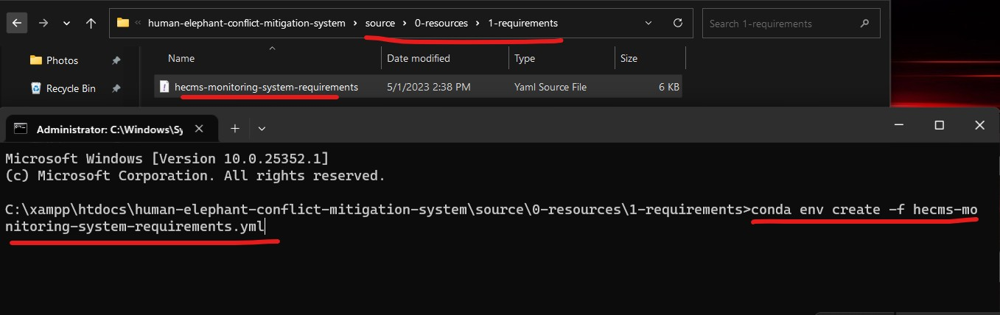

**IMPORTANT:** It will take some time to install all the dependencies automatically; after the installation, an environment will be created with the name "tensorflow_gpu" that environment contains all the required libraries; when running the HECMS Monitoring System, **always make sure to activate that environment** which has necessary libraries.

**To activate:** Use the following command.

```
activate tensorflow_gpu
```

**Note:** After the activation, the project can be run on top of that environment.

##### Additional Information

There is some additional information below to learn more about the Anaconda environment.

- To Install Anaconda Environment

```
  conda env create -f environment.yml
```

- To Export Anaconda Environment

```
  conda env export > environment.yml
```

- To Delete Anaconda Environment

```
  conda env remove -n ENV_NAME
```

- To Create an Anaconda Environment

```
  conda create -n ENV_NAME python=3.9
```

#### 4.1.3 Setting up Database

##### 4.1.3.1 Setup Database

The Monitoring and HECMS Management Systems use the same database to communicate with each other. Therefore, setting up the database first is essential to make both systems work successfully.

To set the database locally, it is recommended to use the XAMPP control panel; there is a MySQL database engine and PHPMyAdmin with it. The database can be found on the following directory.

```
human-elephant-conflict-mitigation-system/source/0-resources/hecms.sql
```

**IMPORTANT:** Give the database name as **hecms**.

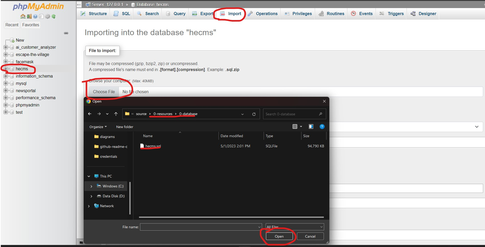

##### 4.1.3.2 Configure Database

This step configures the database with the HECMS Monitoring System; suppose the database is hosted remotely. Letting the HECMS Monitoring System know the credentials and the host is essential. Open the JSON file in the following directory to provide the database credentials and host information.

```
human-elephant-conflict-mitigation-system/source/1-hecms-monitoring-system/assets/credentials/database-credentials.json
```

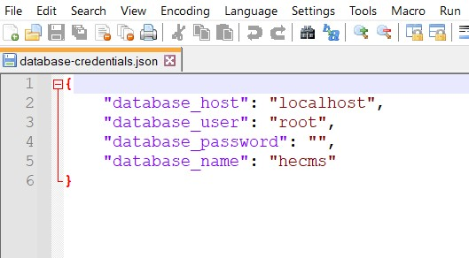

**IMPORTANT:** If the system hosted locally with XAMPP, leave the credentials as same. During the running time of the HECMS Monitoring System, it sends incident information to this database; if the database is hosted somewhere other than localhost, it is important to edit this file.

#### 4.1.4 Setting up Email Sever

**Note:** The HECMS Monitoring System sends emails to the authorities regarding the incidents, to make this function work properly, it is crucial to set up a Google SMTP Email server. Below, the step-by-step guides on setting up the Google SMTP server are provided.

**Step 01:** Choose or create an Google Email to use as a sender: (Ex: hecms_alert@gmail.com)

**Step 02:** Turn on the 2-Step Verification method to allow the email to send mails programmatically.

- 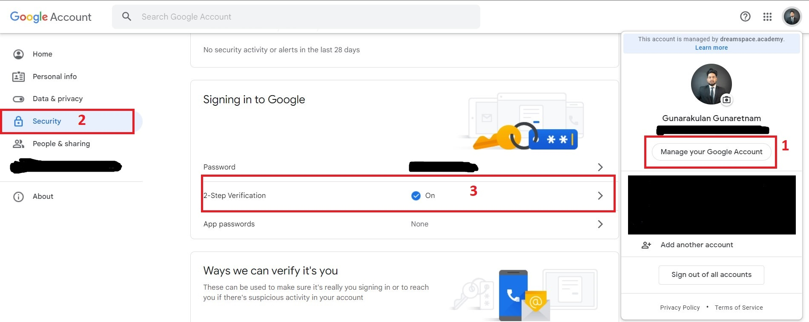

**Note 1:** There are some basic process to turn on the two factor authentication, after turning on, follow the step 3.

**Step 03:** Craete an app password | after creating app password, SMTP server can be setup.

- 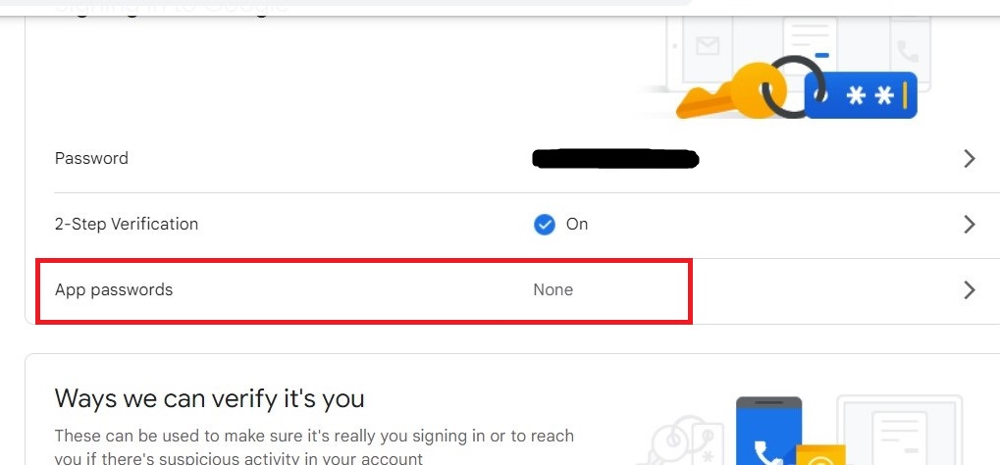

- 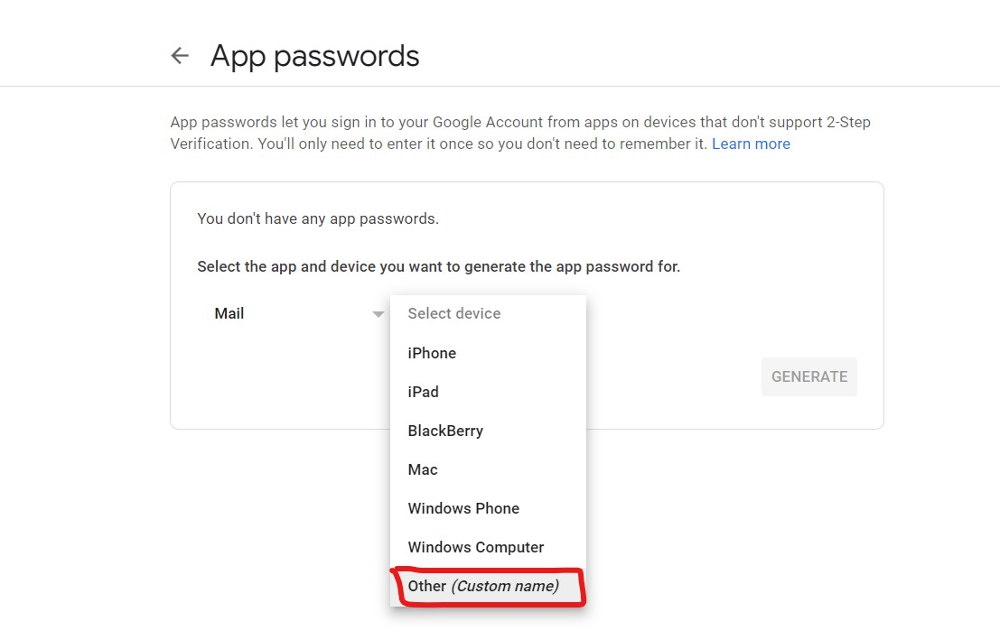

- 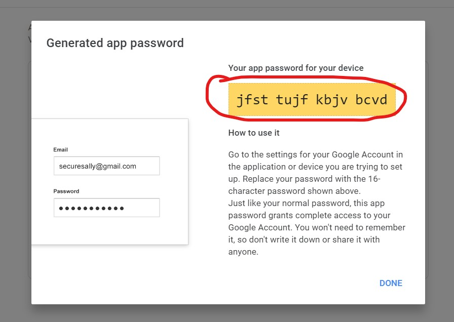

Step 04: Enter the app password and the sender email address in the following JSON file:

```
human-elephant-conflict-mitigation-system/source/1-hecms-monitoring-system/assets/credentials/api-credentials.json
```

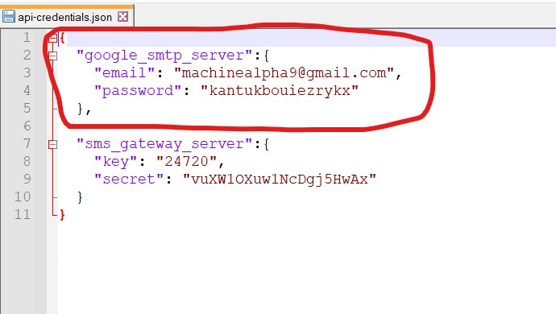

**Note:** Update the email and password under the "google_smtp_server" node.

#### 4.1.5 Setting up SMS Gateway

**Note:** The HECMS Monitoring System sends SMS alert to the villagers regarding the incidents, to make this function work properly, it is crucial to set up a SMS gateway. There are many SMS gateways out there. However, this system uses notify.lk (https://www.notify.lk/) gateway, which is cheap and affordable to use in Sri Lanka.

**IMPORTANT:** Update the gateway credentials in the following JSON file.

```
human-elephant-conflict-mitigation-system/source/1-hecms-monitoring-system/assets/credentials/api-credentials.json
```

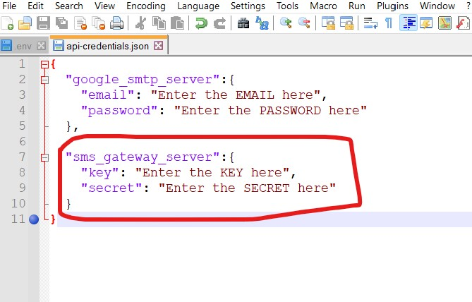

**NOTE:** The notify.lk uses direct endpoints: type GET or POST, a sample format is shown bellow.

```
https://app.notify.lk/api/v1/send?user_id=[USER_ID]&api_key=[API_KEY]&sender_id=NotifyDEMO&to=[TO]&message=Test
```

**Note:** If you choose to use a different SMS gateway, it is your responsibility to write code according to that; different SMS gateway has different sort of code/library. You must find the documentation for the gateway you are using and follow the instructions.

Below are the codes for sending SMS; you can change them according to your selected gateway; if you choose any gateway similar to a direct endpoint instead of a library-based one, you can simply add the key and secret. Otherwise, it is your responsibility to write code.

```
human-elephant-conflict-mitigation-system/source/1-hecms-monitoring-system/utilities.py
```

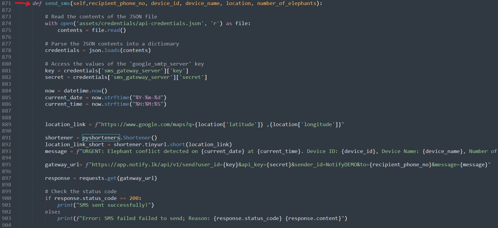

### 4.2 Setup HECMS Management System

#### 4.2.1 Hosting

This section explains how to set up the HECMS Management System. It is built with Laravel and can be configured quickly on shared hosting or any apache-based servers that run on PHP.

To host it locally on a computer, XAMPP control panel can be used for that. XAMPP is a free and open-source cross-platform web server solution stack package developed by Apache Friends; we can use it for local deployment of PHP-based projects.

Official Website: https://www.apachefriends.org/

**IMPORTANT 1:** The soruce code of the HECMS Management System is found under the following directory

```
human-elephant-conflict-mitigation-system/source/2-hecms-management-system
```

**IMPORTANT 2:** Projects that are built with Laravel can be accessed by opening the public folder, in the source code of HECMS Management System, there is a folder called public, if that opened, it could be accessed, otherwise it won't work, when deploying on servers, it is very important to point to that folder instead of pointing on index.php/index.html.

#### 4.2.2 Configure Database

**IMPORTANT 1:** The HECMS Monitoring and the HECMS Management Systems use a central database (hecms.sql). The database setting up process is already shown in the above section. If you plan to host the system remotely, hosting the database in MySQL remote engine is essential, you also have to configure the database credentials according to that in the HECMS Monitoring System as shown in the "4.1.3.2 Configure Database" section of "4.2 Setup HECMS Management System".

**IMPORTANT 2:** If you want to configure the HECMS Management System database credentials, edit the following env file.

```
human-elephant-conflict-mitigation-system/source/2-hecms-management-system/.env
```

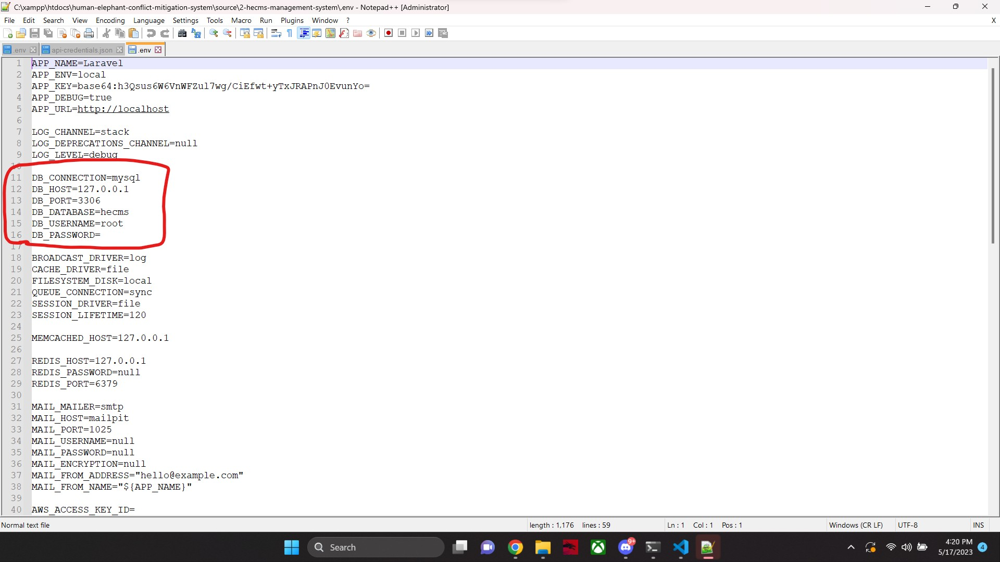

## 05 Execution

After setting up the HECMS Monitoring & Management Systems and installing all required dependencies and libraries, the next step is to run the system; this section explains how to run the HECMS Monitoring & Management Systems and also describes how to run the project prototypes that are in the "research" folder.

### 5.1 Execution of HECMS Monitoring System

The HECMS Monitoring System can be found on the following directory, "1-hecms-monitoring-system", the folder can copied to any place that it wants to be deployed.

```
human-elephant-conflict-mitigation-system/source/1-hecms-monitoring-system
```

- **Step 01:** Activate the environment

```
conda activate tensorflow_gpu
```

- **Step 02:** Execute main.py script

```
python main.py
```

### 5.2 Execution of HECMS Management System

The HECMS Management System can be opened using a web browser; it is based on where it is deployed; if it is deployed on localhost, it can be accessed by http://localhost/ and navigate to the public folder.

#### 5.2.1 HECMS Management System Super Admin Credentials

- **Username:** admin
- **Password:** admin
- **Account Type:** Super Admin

**IMPORTANT:** Device admin can be created using the super admin account.

### 5.3 Execution of HECMS Monitoring System (Project Prototypes)

Some project prototypes are in the research folder; these prototypes were built as research work before making the final version of the HECMS Monitoring System. There are four different prototypes in the research folder.

- Path of project prototypes folder

```
human-elephant-conflict-mitigation-system/research/0-project-prototypes
```

```text
.
├── 0-elephant-detection-only                          # This prototype has elephant detection feature only.
├── 1-elephant-detection-with-alarm-and-email-alert    # This prototype can detect elephants and send email alert.
├── 2-elephant-detection-with-tensorflow-lite          # This prototype has elephant detection only with TensorFlow Lite Model.
└── 3-elephant-detection-custom-trained-model          # This prototype has elephant detection with custom trained model with 2k images.
```

#### 5.3.1 Execution of 0-elephant-detection-only

- **Step 01:** Activate the environment

```
conda activate tensorflow_gpu
```

- **Step 02:** Execute main.py script

```
python main.py
```

#### 5.3.2 Execution of 1-elephant-detection-with-alarm-and-email-alert

- **Step 01:** Activate the environment

```
conda activate tensorflow_gpu
```

- **Step 02:** Execute main.py script

```
python main.py
```

#### 5.3.3 Execution of 2-elephant-detection-with-tensorflow-lite

- **Step 01:** Activate the environment

```
conda activate tensorflow_gpu
```

- **Step 02:** Execute main.py script

```
python main.py
```

#### 5.3.4 Execution of 3-elephant-detection-custom-trained-model

- **Step 01:** Activate the environment

```
conda activate tensorflow_gpu
```

- **Step 02:** Execute main.py script

```
python main.py
```

## 06 Testing

This section contains the source code of test cases for HECMS Monitoring and Management systems, and these test cases scripts can be used to test the system automatically.

The test case scripts can be found under the following directory.

```
human-elephant-conflict-mitigation-system/test
```

```text
.
├── 0-test-case-for-hecms-monitoring-system     # Test case of HECMS Monitoring System written in Python & PyAutoGUI.
└── 1-test-case-for-hecms-management-system     # Test case of HECMS Management System written in Python & Selenium.
```

### 6.1 Test Case for HECMS Monitoring System

#### 6.1.1 Execution

##### Step 01: Navigate to the following directory

```
human-elephant-conflict-mitigation-system/test/0-test-case-for-hecms-monitoring-system
```

##### Step 02: Activate environment

```
conda activate tensorflow_gpu
```

##### Step 03: Run the HECMS Monitoring System before running test cases.

- HECMS Monitoring System Path

```
human-elephant-conflict-mitigation-system/source/1-hecms-monitoring-system
```

- Run the HECMS Monitoring System

```
python main.py
```

##### Step 04: Run the test cases.

```
python main-test.py
```

https://github.com/gunarakulangunaretnam/human-elephant-conflict-mitigation-system/assets/45822509/d71748a8-7d37-4590-8ef4-bdb2837524df

**Note:** The test case script will wait 5 seconds before it ends; click the HECMS Monitoring System window to be selected.

#### 6.1.2 Test Results

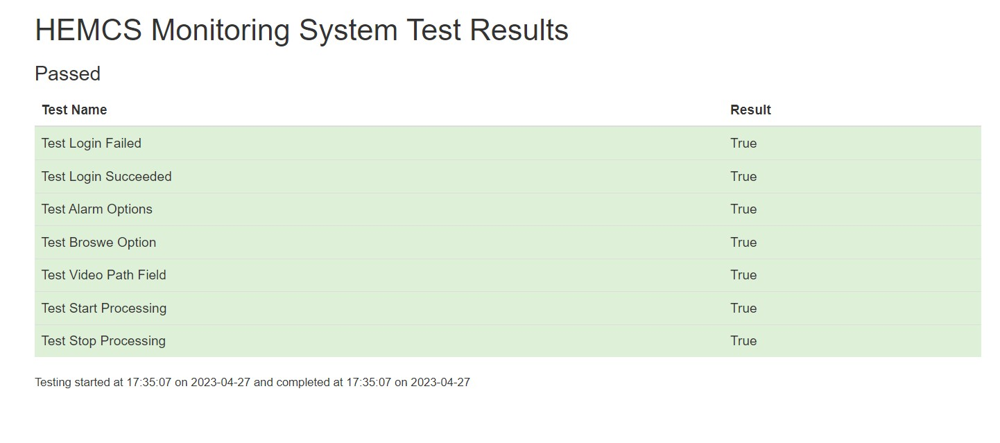

### 6.2 Test Case for HECMS Management System

#### 6.2.1 Execution

##### Step 01: Navigate to the following directory

```
human-elephant-conflict-mitigation-system/test/0-test-case-for-hecms-management-system
```

##### Step 02: Activate environment

```
conda activate tensorflow_gpu
```

##### Step 03: Give the HECMS Management System Domain (URL)

- Open the following file and edit the URL where you have deployed the HECMS Management System.

```
human-elephant-conflict-mitigation-system/test/0-test-case-for-hecms-management-system/utilities.py
```

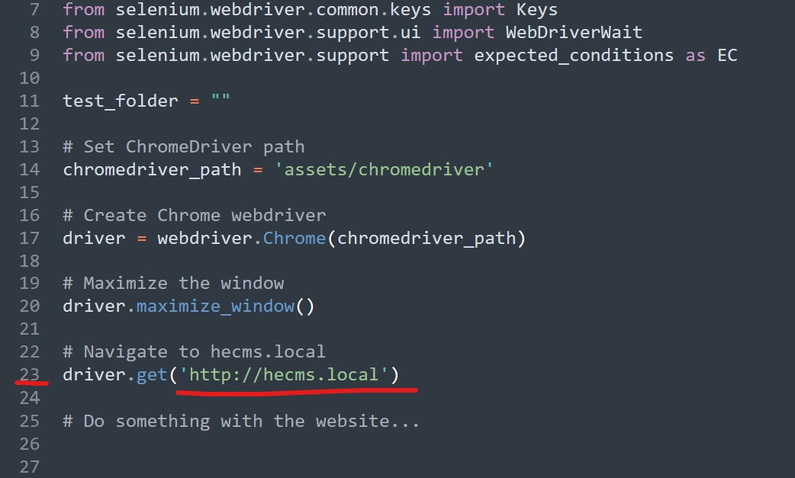

##### Step 04: Run the test case script.

```
python main-test.py
```

https://github.com/gunarakulangunaretnam/human-elephant-conflict-mitigation-system/assets/45822509/d51e6c0d-3a7a-4702-bf37-d1cf119dc9ec

#### 6.2.2 Test Results

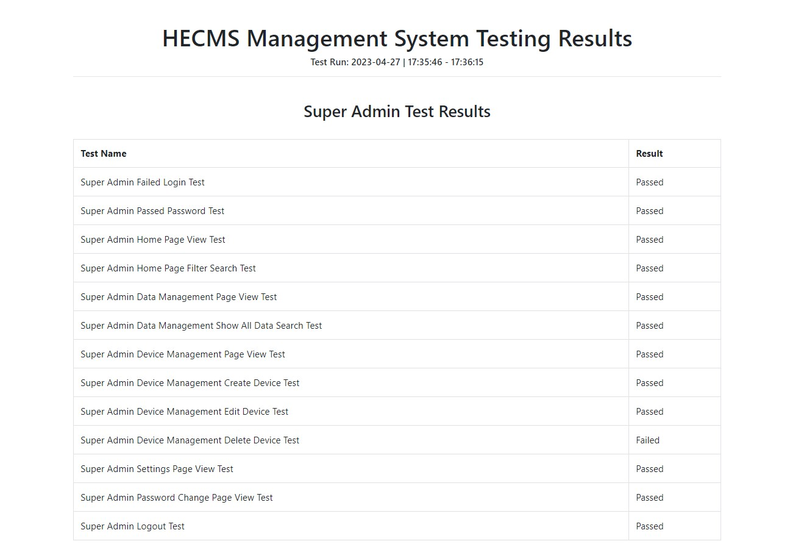
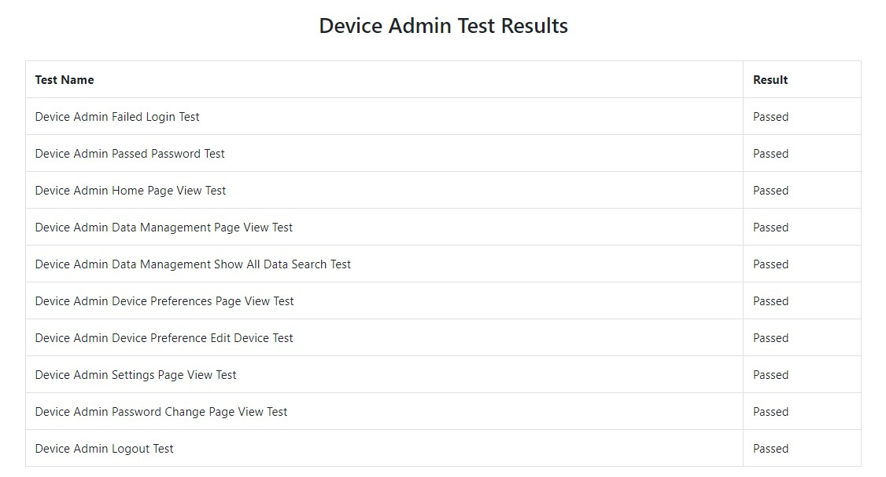

## 07 Additional Information

This section contains additional information about the project; these steps are unnecessary but essential to know. It has bugs, errors and solutions, and other information.

### 7.1 Errors & Bugs

#### Error 1

**Note:** After installation, if any errors occur similar to **"ModuleNotFoundError: No module named 'tensorflow.python.keras.preprocessing'"**, do the following steps to fix it.

**Step 01:**

```
  pip install tensorflow==2.5.0

```

**Step 02:**

```
  pip install tensorflow==2.7.0

```

### 7.2 Instal Object Detection Framework

**Note:** Installing an object detection framework to run the HECMS project is optional, but it would be helpful in training and building different object detection projects from scratch.

In order to install the object detection framework, clone the following repository. This repo contains Google Research of TensorFlow and Object Detection essential Contents.

Clone this Google models repository:- [https://github.com/tensorflow/models](https://github.com/tensorflow/models)

This repo is large. it contains almost all files of the TensorFlow and Google Object Detection Framework researches, we should install it manually to utilize the object detection framework.

- Clone models repo

  ```
    git clone https://github.com/tensorflow/models.git
  ```

Now, we have to download Protobuf to convert the serialize structured data.

Download Protobuf:- [https://github.com/protocolbuffers/protobuf/releases](https://github.com/protocolbuffers/protobuf/releases)

01.Extract it.

02.Copy the protoc.exe and paste it under the cloned repo (models/research) folder.

- From models/research folder, Execute the following code in CMD

  ```
    protoc object_detection/protos/*.proto --python_out=.
  ```

  03.To install the object detection manually, copy the setup.py that is under (models/research/object_detection/packages/tf2/setup.py) and paste in the (models/research) folder.

- Install object detection manually from (models/research).

  ```
    pip install -e .
  ```

  04.After the installation, we don't need the cloned models repo anymore.

## 07 Demonstration

The demonstration section presents the project outcomes, highlights the functionalities, and provides a comprehensive overview of HECMS Monitoring and Management Systems. It showcases the project's deliverables, showcasing its functional components, features, and capabilities.

- Monitoring System

  - Login Option
  - Processing Panel
  - Video Options Panel
  - All features

- Management System

  - Super Admin
    - Login Option
    - Dashboard
    - Data Management
    - Device Management
    - Settings
  - Device Admin
    - Login Option
    - Dashboard
    - Data Management
    - Device Preferences
    - Settings

### 7.1 Monitoring System

The monitoring system is the primary system that runs on the ground to analyze video frames, detects elephants, sends warning email/SMS, and updates the conflict data to the management system. The result of the system is perfect, and it is built with so many functionalities and features. This section will explain the module and parts of the monitoring step by step.

https://github.com/gunarakulangunaretnam/human-elephant-conflict-mitigation-system/assets/45822509/06fbcfc2-7949-40f6-b06d-10bfb7c24023

https://github.com/gunarakulangunaretnam/human-elephant-conflict-mitigation-system/assets/45822509/bb6862ea-e62d-476c-9afb-826ebdf01e73

https://github.com/gunarakulangunaretnam/human-elephant-conflict-mitigation-system/assets/45822509/9ebb7d25-f1fa-4499-9dc2-e6b06e6ebe46

#### 7.1.1 Login Screen – Monitoring System

This is the login screen of the monitoring system. Login credentials are created in the management system as Device Admin, and that credential can be used to login into the system.

- Features
  - Successful login when credentials are matched.
  - Display an error message when a wrong credential is provided.
  - Clear textboxes automatically after a wrong credential is provided.


#### 7.1.2 Dashboard – Monitoring System

This is the main dashboard of the monitoring system, and this dashboard contains a lot of features and functionalities. It is the primary system with AI-powered models to detect elephants in real-time, send SMS and email, and update the database, this is the dashboard, and this dashboard was with Python and Tkinter framework.

This dashboard allows video processing from various sources, including the device camera, IP camera, pre-recorded videos, or browsing and selecting videos. There is an input video streams feature for real-time monitoring or analyzing recorded videos for post-event analysis. There are many features that are listed below.

- Features
  - Process video from the device camera.
  - Process video from IP camera.
  - Process video from pre-recorded videos.
  - Browse to select videos.
  - Have a screen to show the output on the left side.
  - Snapshot button to take snaps of the screen.
  - Threshold slider to adjust the detection rate.
  - Alarm turns on/off feature.
  - Sound effects can be changed.
  - Model architecture can be changed.
  - The brightness of the video can be adjusted.
  - The Contrast of the video can be adjusted.
  - The Blurriness of the video can be adjusted.
  - Start Process button to begin the process.
  - Stop Process button to stop the process.
  - Restore Default Settings button to clear the changed options.

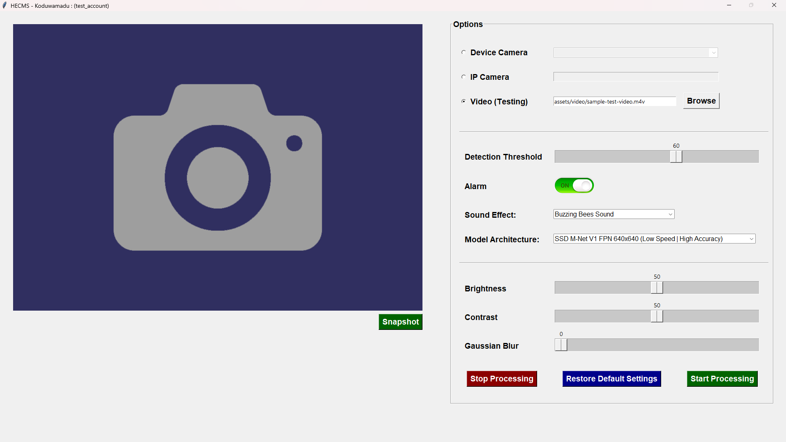
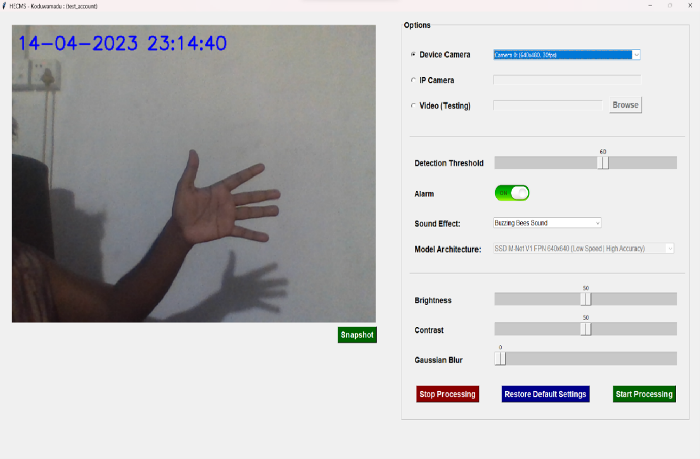
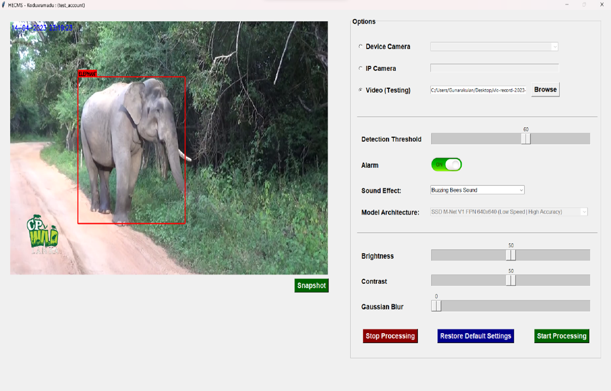
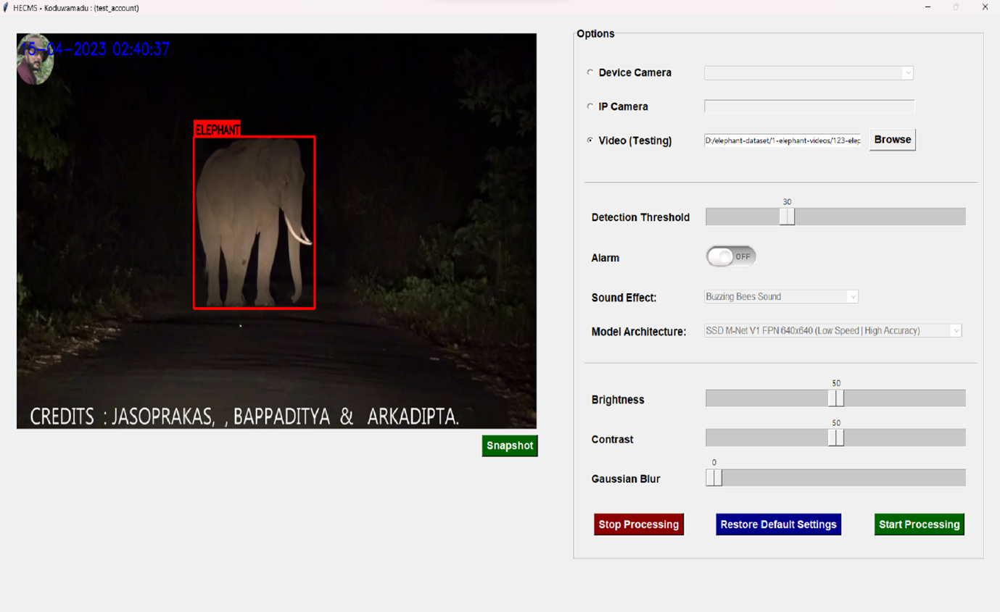
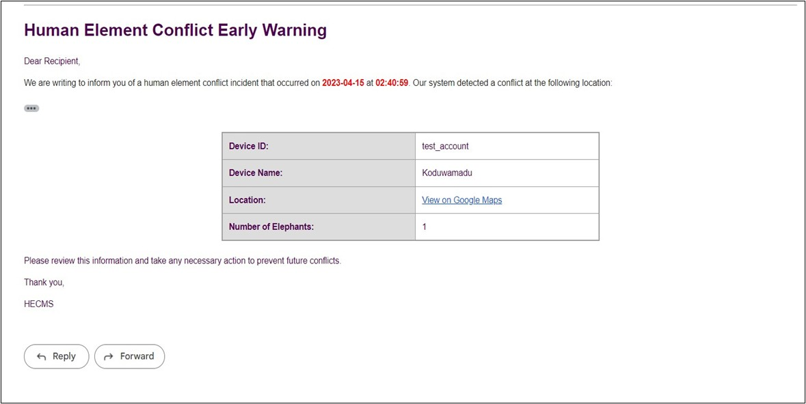
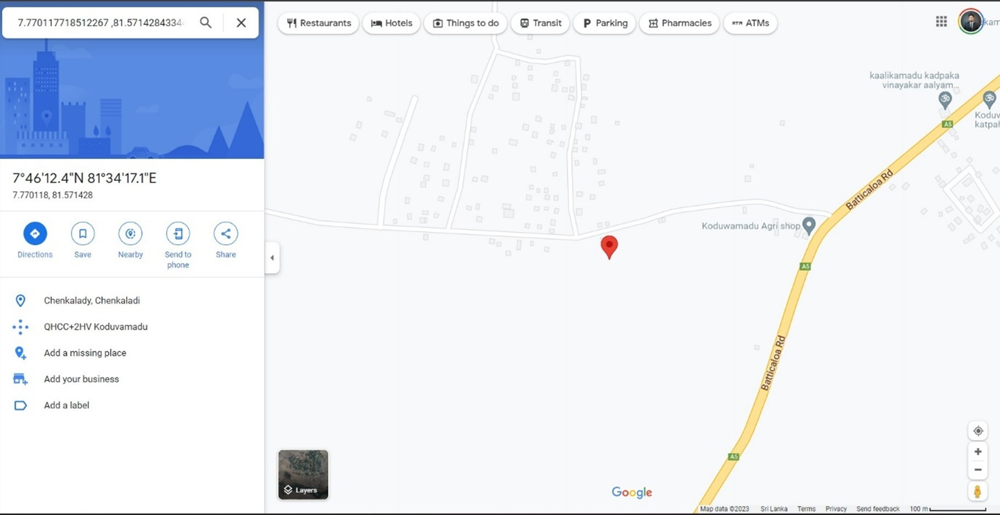
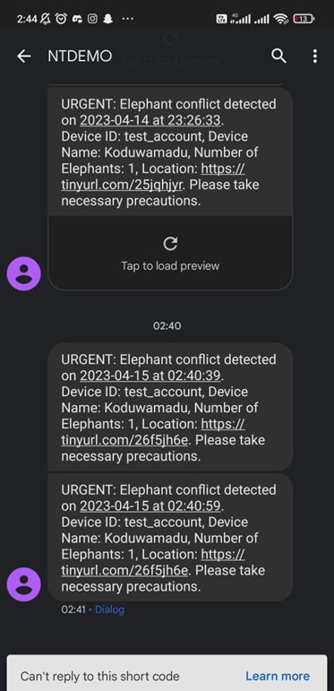
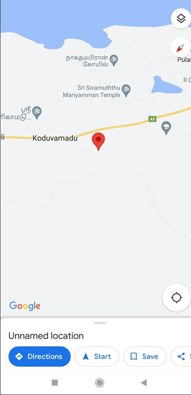

### 7.2 Management System

The management system is the secondary system used by the head office of the conflict management team to analyze the data. It is the core of the system because all the data will be transmitted to it and even monitoring system login accounts can be one created in the management system. There are two accounts in the management system, those are Super Admin is only used by the head office, the other one is Device Admin, which could be created by the management system and can be used in the monitoring system and well as in the management system to see its detection data.

https://github.com/gunarakulangunaretnam/human-elephant-conflict-mitigation-system/assets/45822509/2489fa30-180c-48e1-852c-9dbecbbe2e1d

#### 7.2.1 Login Page – Management System

The Management System login page has two different account types: Super Admin and Device Admin.

- Features
  - Able to select which account type that is wanted to be logged in.
  - Successful login when credentials are matched.
  - Display an error message when a wrong credential is provided.
  - Clear textboxes automatically after a wrong credential is provided.

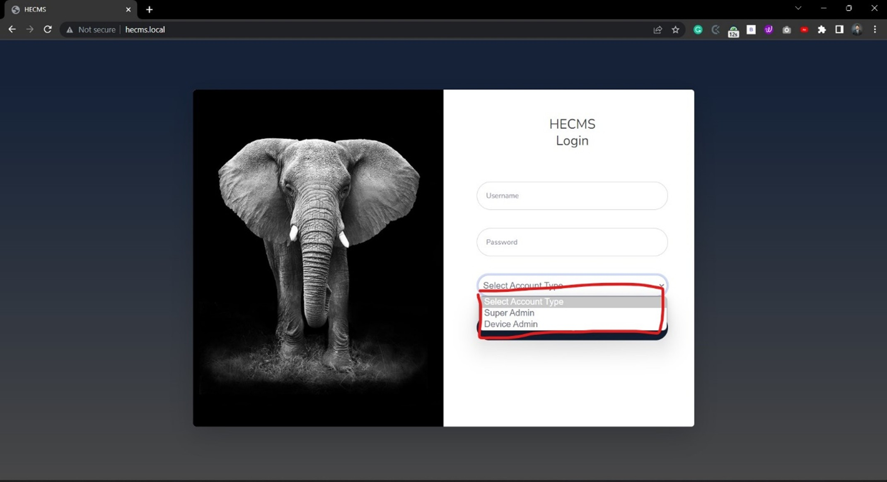

#### 7.2.2 Homepage – Management System (Super Admin)

This is the Management System Homepage, also known as the dashboard of the Super Admin; it has so many features and functionalities. A line chart plots the elephant data by monthly; This Super Admin will get all the data transmitted by all the registered devices. Apart from the functional-based features, there are many UI-based features, such as an animative line chart, nice fade-in / face-out effects on hovering, etc. All the functional features are listed below.
The sidebar has all the Super Admin pages, such as Data Management, Device Management, and Settings. Data management has all the data transmitted by all the devices; device management has all the created device information and has functionalities like creating new devices, deleting devices editing devices and viewing device locations, etc.

- Features
  - Plot all the detection data on a monthly wise line chart.
  - A monthly-wise filter is built on the right top of the line chart.
  - Display the total number of devices created in the system.
  - Display the total number of elephant conflict incidents identified by all devices.
  - Display the total number of elephants detected by all devices.

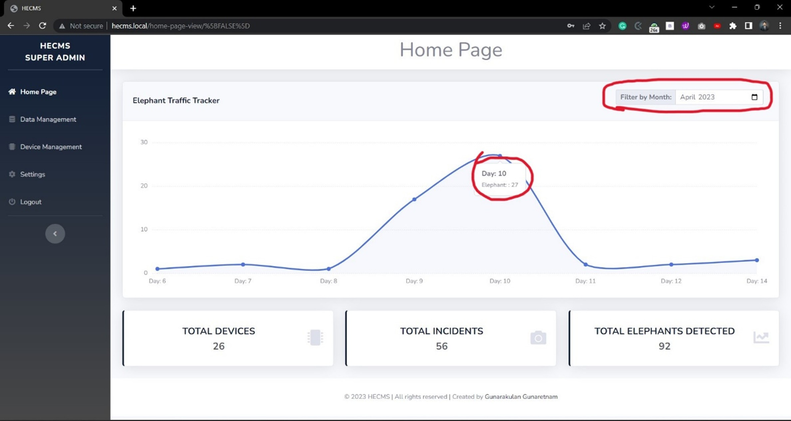

#### 7.2.3 Data Management Page – Management System (Super Admin)

This is the Management System data management page of Super Admin; This page fetches all the human-elephant conflicts data from the database that were transmitted by all the devices. It has so many features to view data. This page has a table with columns such as Device ID, Date, Time, Number of Elephants Detected, and Image; It has a built-in day-wise filter option to fetch data from the database on a specific date, and there is an option to view image on new tap to see it more clear with zoom options.

- Features
  - Show all conflict incidents data captured by all devices in the table.
  - Have a pagination panel that splits data by 15 to speed up the system.
  - Have a day-wise filter to list by a specific date.
  - Have a radio button to switch between filter options.
  - Show all data as a radio button option.
  - Have a feature to view the incident image on a new window with zoom ability.

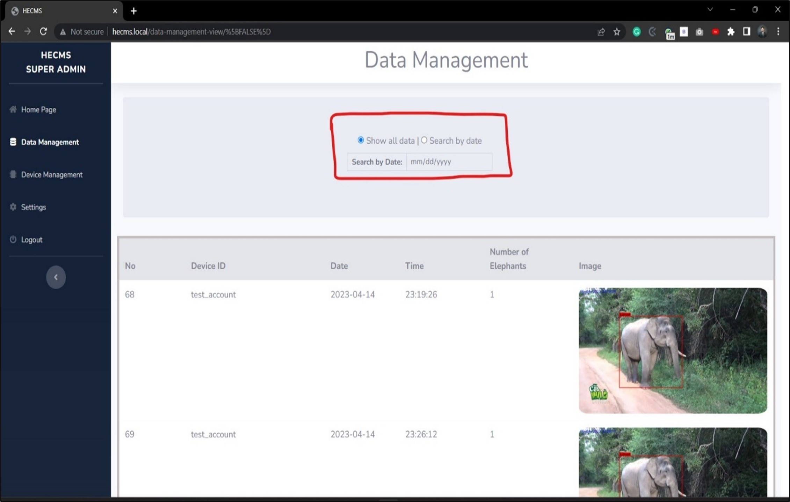
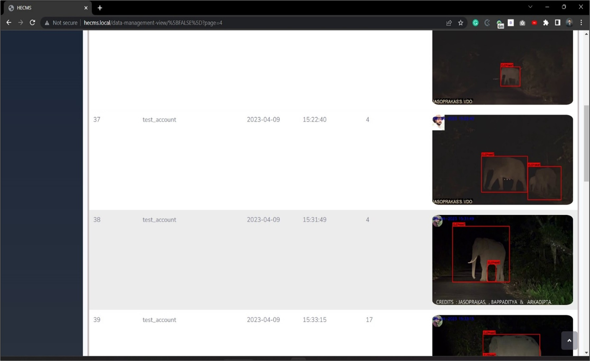
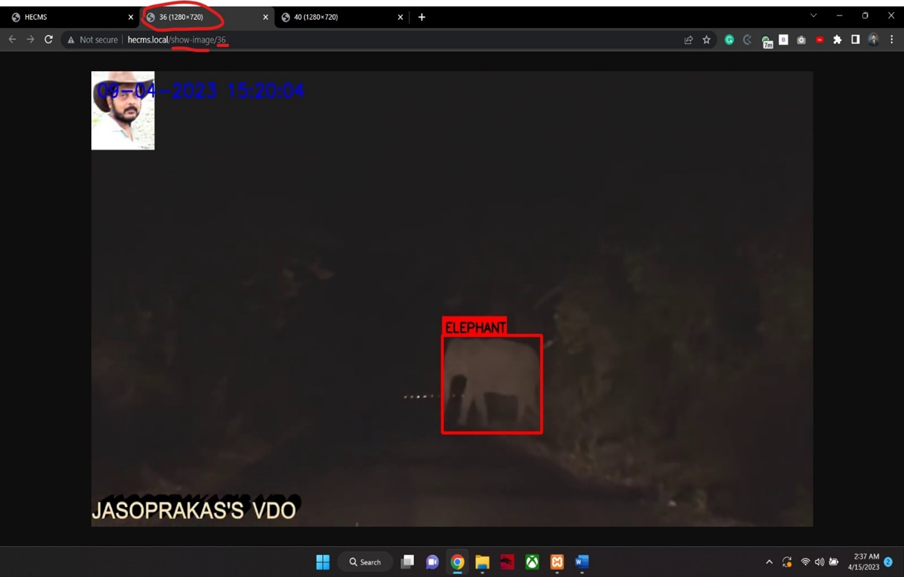

#### 7.2.4 Device Management Page - Management System (Super Admin)

This is the Management System device management page of Super Admin; It is the core part of the system because device creation, deletion, updating, all device-related functions, and data are managed by this page.

- Features
  - Show all the device data in a table.
  - Have a feature to create a new device.
  - Have the option to delete devices.
  - Have the option to edit/update devices.
  - Have a pagination panel that splits data by 15 to speed up the system.
  - Have a feature to ask for confirmation before deleting devices completely.
  - Have the option to view the device’s location on Google Maps.
  - Have a feature to show a successful message when a successful operation occurs.
  - Have a feature to show an error message when an error occurs.

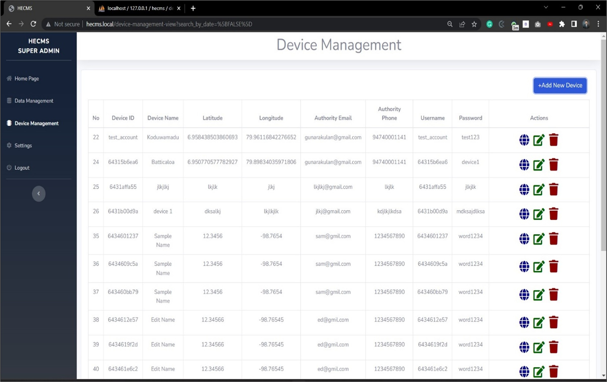
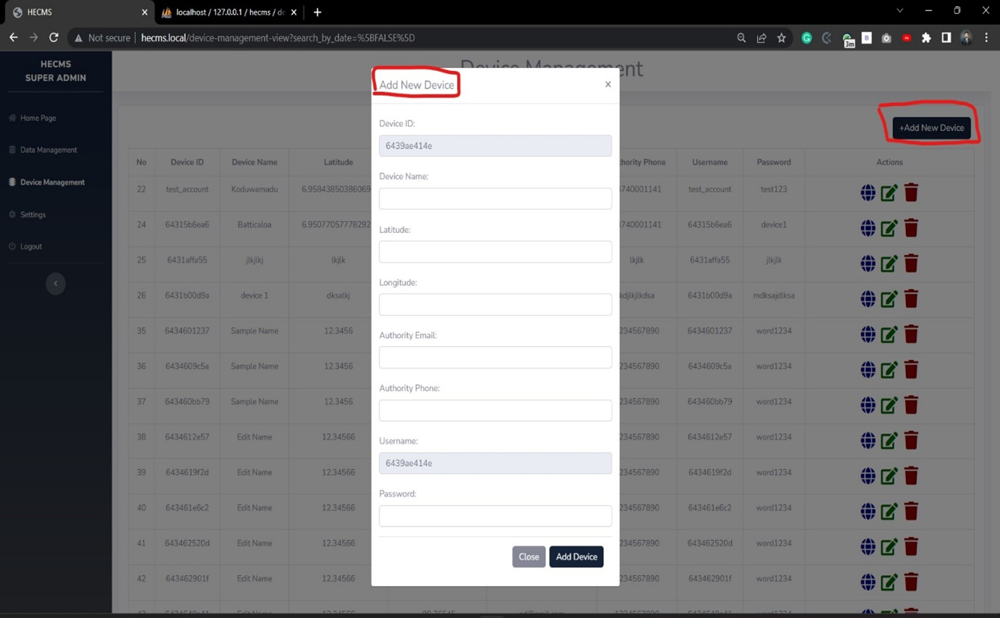
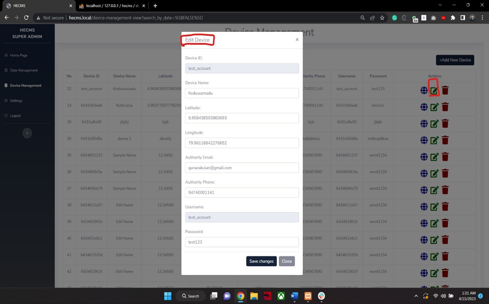
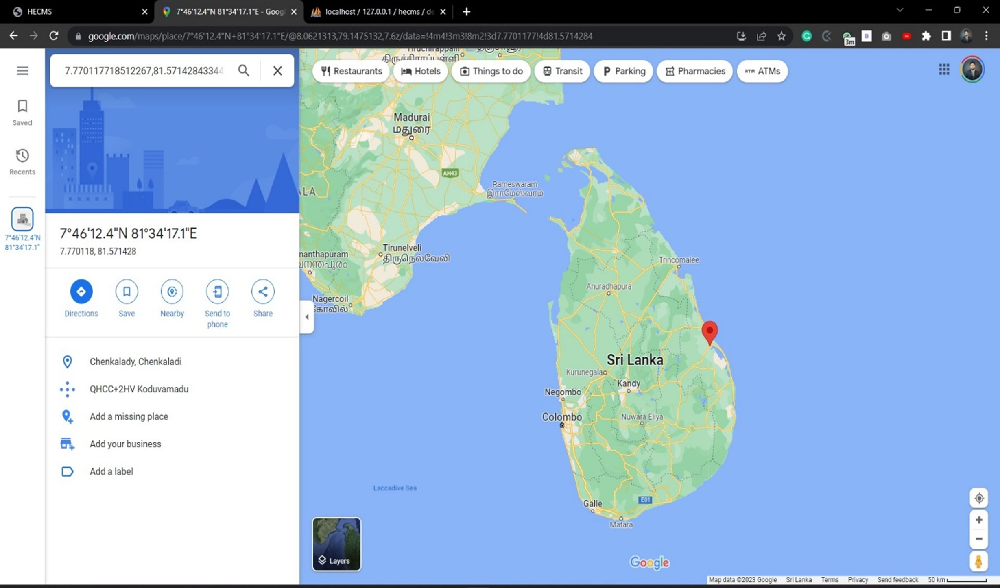
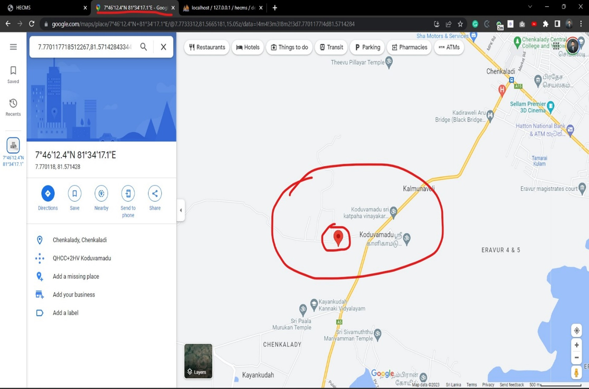

#### 7.2.5 Device Settings Page - Management System (Super Admin)

This is the Management System setting page of the Super Admin; it has features to change the password of the Super Admin; in the future, a feature will be added to the settings page to make it more standardized.

- Features
  - Change the password of the Super Admin.
  - Have a feature to show a successful message when a successful operation occurs.
  - Have a feature to show an error message when an error occurs.
  - Have a feature to check the confirmation password.
  - Have a feature to check the current password.


#### 7.2.6 Homepage – Management System (Device Admin)

This is the Management System Homepage, also known as the dashboard of the Device Admin; it has so many features and functionalities related to the device. A line chart plots the elephant data monthly; This Device Admin will only get the data transmitted by its thin client. Apart from the functional-based features, there are many UI-based features, such as an animative line chart, nice fade-in / face-out effects on hovering, etc. All the functional parts are listed below.

The sidebar has all the Device Admin pages, such as Data Management, Device Preferences, and Settings. Data management has the data transmitted by the current device through a thin client; Device Preferences have information about the current device and can be edited. In the side bar, it also shows the device information such as device name and ID.

- Features
  - Plot the detection data of the currently logged-in device on a monthly-wise line chart.
  - A monthly-wise filter is built on the top of the line chart.
  - Have a button to locate the location of the currently logged-in device.
  - Display the total number of elephant conflict incidents identified by the current device.
  - Display the total number of elephants detected by current device.

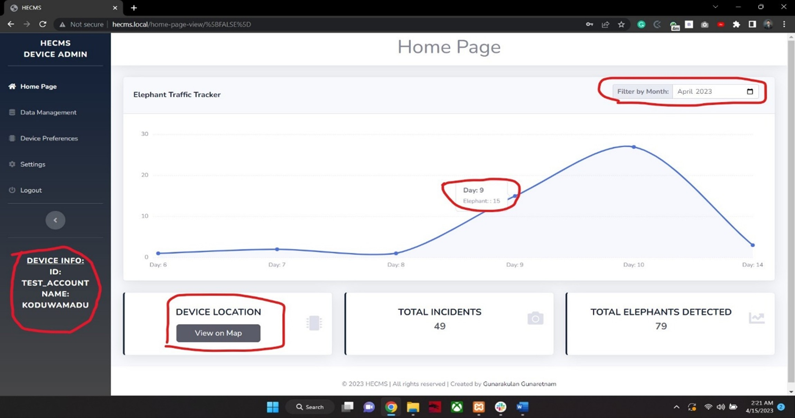

#### 7.2.7 Data Management Page – Management System (Device Admin)

This is Device Admin's Management System data management page; This page fetches currently logged-in device elephant conflicts data from the database transmitted by its thin client. It has so many features to view data. This page has a table with columns such as Date, Time, Number of Elephants Detected, and Image; It has a built-in day-wise filter option to fetch data from the database on a specific date, and there is an option to view images on new tap to see it more clear with zoom options.

- Features
  - Show all conflict incidents data captured by the current device in the table.
  - Have a pagination panel that splits data by 15 to speed up the system.
  - Have a day-wise filter to list by a specific date.
  - Have a radio button to switch between filter options.
  - Show all data of the current device as a radio button option.
  - Have a feature to view the incident image on a new window with zoom ability.

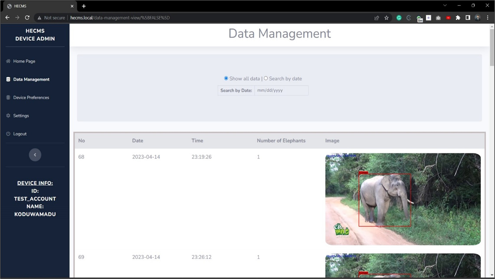
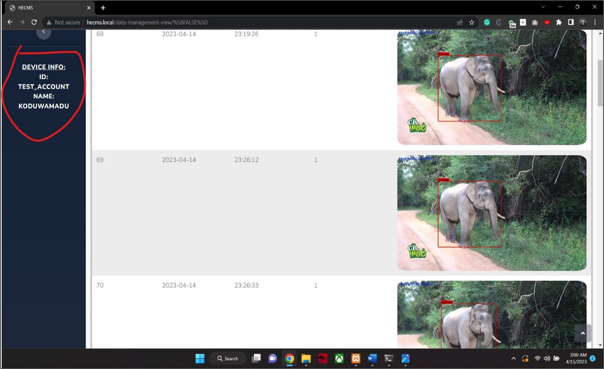
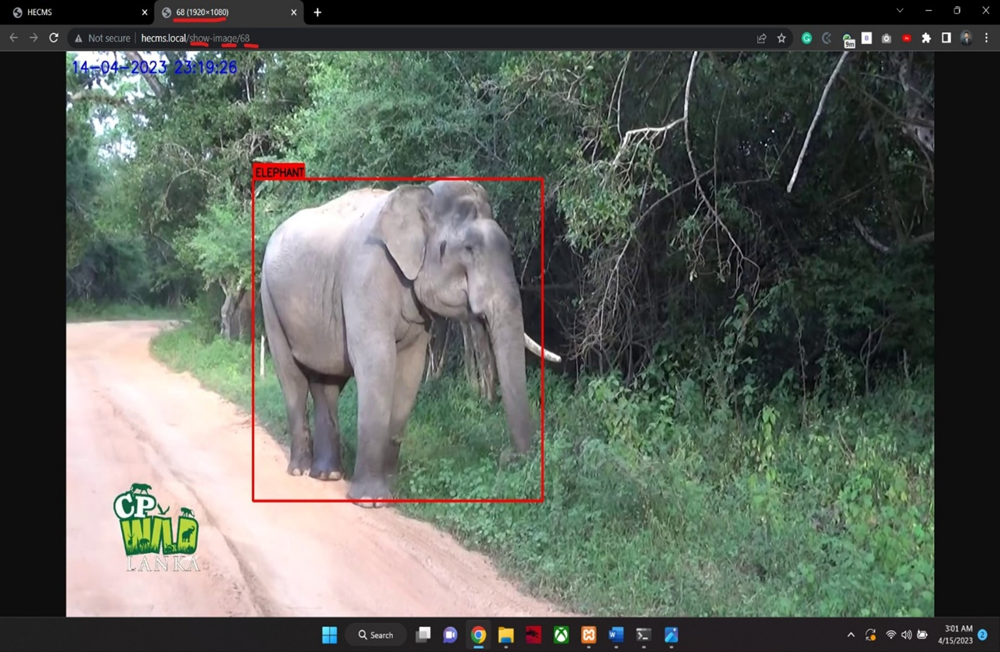

#### 7.2.8 Device Preferences Page – Management System (Device Admin)

This is Device Admin's Management System device preferences page; It is used to update/edit current device information.

- Features
  - Show the current device information.
  - Have an option to edit device data.
  - Have a feature to show a successful message when a successful operation occurs.
  - Have a feature to show an error message when an error occurs.

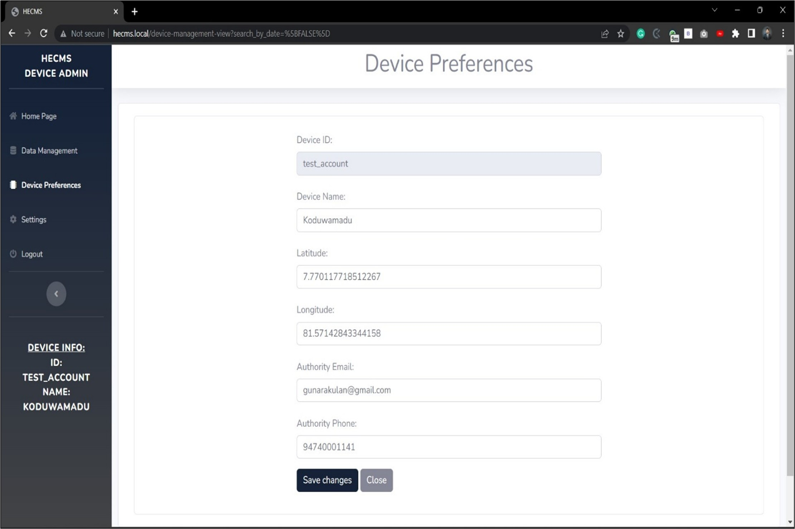

#### 7.2.8 Device Settings Page – Management System (Device Admin)

This is the Management System setting page of the Device Admin; it has features to change the password of the currently logged-in Device Admin; in the future, a part will be added to the settings page to make it more standardized.

- Features
  - Change the password of the Super Admin.
  - Have a feature to show a successful message when a successful operation occurs.
  - Have a feature to show an error message when an error occurs.
  - Have a feature to check the confirmation password.
  - Have a feature to check the current password.

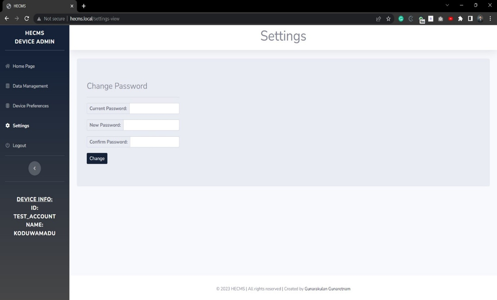

# CONTACT

### Website: 

[](https://www.gunarakulan.info)

### Social Media:

[](https://www.linkedin.com/in/gunarakulangunaretnam)
[](https://www.facebook.com/gunarakulangunaretnam)
[](https://wa.me/94740001141?text=WhatsApp%3A%20%2B9740001141)
[](https://www.instagram.com/gunarakulangunaretnam)
[](https://x.com/gunarakulangr)
[](https://www.kaggle.com/gunarakulangr)
[](https://www.tiktok.com/@gunarakulangunaretnam)
[](https://www.youtube.com/channel/UCjMOdgHFAjAdBKiqV8y2Tww)
