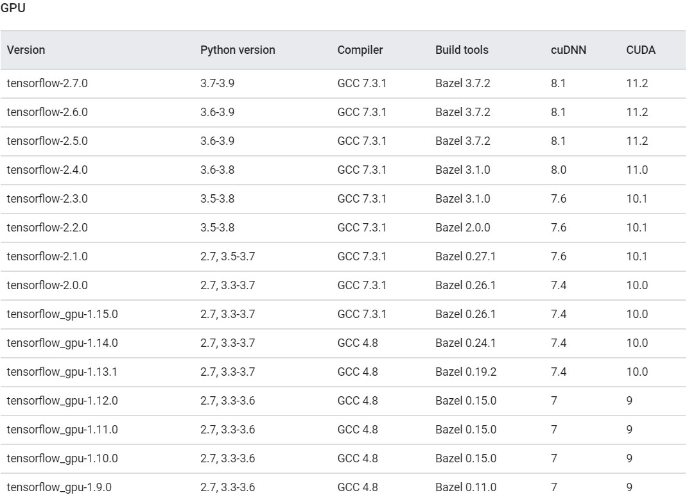
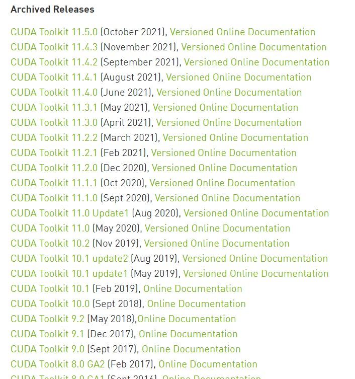
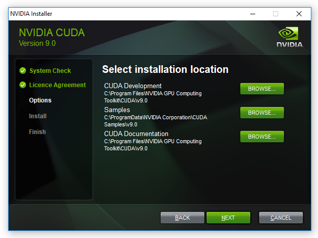
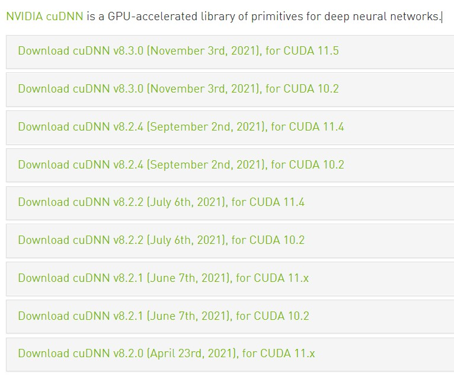
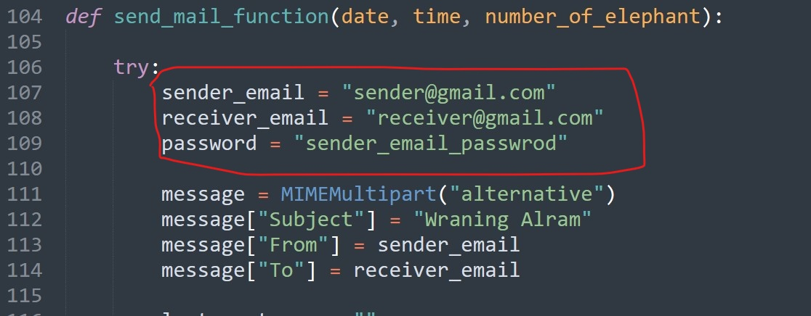
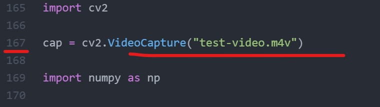

# Human Elephant Conflict Mitigation System

## 01 Introduction

The human-elephant conflict is a persistent issue in Sri Lanka, where elephants are integral to the country's natural beauty and tourism industry. Due to this conflict, several lives and properties have been lost in rural areas of the country. The Sri Lankan government has been using electric fences to prevent elephants from entering villages, but it is unreliable.

An Artificial Intelligence-based Human Elephant Conflict Mitigation System has been developed to address the persistent issue of human-elephant conflict in Sri Lanka. The system employs CCTV cameras and wildlife camera traps to detect elephants in video frames and subsequently sends early warning messages to the corresponding village authorities to take appropriate actions. Furthermore, the system implements external methods, such as artificial sounds of buzzing bees and firecrackers, to discourage elephants from entering village areas.

The system is designed to provide efficient results during the day and nighttime, and it includes features like elephant detection, early warning SMS/email, and a management system dashboard. The system also updates the conflict information in the database to be analyzed by the conflicts management team.

The system aims to lead Sri Lankan communities in technology to be more powerful and productive to have beautiful lives for everyone. The ultimate goal of this project is to mitigate human-elephant conflicts and promote a sustainable solution for the issue.


## 02 Technology Stack

### 2.1 Primary Programming Tools

| Programming Tools | Version     | Description                     |
| ----------------- | ----------- | ------------------------------- |
| **Python**        | Ver: 3.8    | Use to build monitoring system. |
| **MySQL**         | Ver: 15.1   | Used as central database.       |
| **Laravel**       | Ver: 10.3.3 | Use to build management system. |

### 2.2 Python Dependencies (Monitoring System)

| Programming Tools   | Version       |
| ------------------- | ------------- |
| **TensorFlow**      | Ver: 2.7.0    |
| **Keras**           | Ver: 2.7.0    |
| **OpenCV**          | Ver: 4.6.0.66 |
| **MySQL Connector** | Ver: 2.2.9    |
| **Pillow**          | Ver: 8.4.0    |
| **Pygame**          | Ver: 2.3.0    |
| **PyShorteners**    | Ver: 1.0.1    |

## 03 System Architecture

This section presents an overview of the system architecture for the Artificial Intelligence-based Human Elephant Conflict Mitigation System. The system architecture comprises various elements, including diagrams, flowcharts, components, UML use-case and class diagrams, ER-Diagrams, etc.

### 3.1 Architecture Diagram


There is a “Head Office” on the right side of the diagram, which means they will use the Management System, and all the conflict incidents data will be transferred to it and can be analyzed and accessed by the Head Office.

On the left side, there are two zones presented as examples, “Habarana Zone” and “Anuradhapura Zone” (Popular elephant conflict places in Sri Lanka), and each zone has a device admin. That device admin has basic access to the Management System through the Device Admin account. Each zone has a Monitoring System installed on a computing device that processes video frames to check elephant presence. If elephants are detected, it will send an SMS to the corresponding villager and an email to “Head Office,” The incident data will be transmitted to Management System. Those can be accessed by “Head Office” and that device admin.In the middle, the database is shared between Management and Monitoring systems to proceed with the granted operations.

### 3.2 Structure Diagram


The above structured-based architecture diagram clearly explains how the Human Element Conflict Mitigation System (HECMS) functions structurally. HECMS is divided into two main sub-systems: the Monitoring System and the Management System.

Both systems have a shared database in the middle, and their main functionalities are also clearly mentioned; the monitoring system’s primary functions are Elephant detection, SMS sending, Email Sending, artificial sound playing, and database updating, and the management system’s functions are analyzed data, manage data, and create new devices, etc.

### 3.3 Elephant Detection Process Flowchart


This flowchart explains how the elephant model detection functions. First, it gets the video stream as the input source; then, it will be transmitted to the next layer to break the video into frames. A frame will be sent to the preprocessing unit to clean up, and then inverts the frame into a numerical vector. The frame will be thrown to the neural network for processing, and then it outputs the confidence value; if the confidence value is greater than or equal to the threshold value, it is considered a positive prediction, and then the system will play artificial sound, send SMS, email, and update database; otherwise, the system processes each frame one by one in a looping manner.

## Configuration & Setup

This project supports CPU and GPU environments to run. If your computer has a GPU (Graphics Processing Unit) with CUDA-Enabled, You can setup a GPU-TensorFlow version to run this application much faster.

If you don't have a GPU, you can still install this application with CPU-TensorFlow version. However, the processing speed with CPU is much slower than the processing on GPU.

If your computer has a GPU, you need to install CUDA & CUDDN to enable the GPU support for TensorFlow. Installation process of CUDA & CUDDN is a bit tricker than the normal TensorFlow installation.

### 01. Installing CUDA & CUDDN

If your computer has no GPU, You should skip this installation, you can run this application with CPU. However, It will be much slower. If your computer has a GPU but, you don't like to install CUDA & CUDDN, you can still skip this process. But, this application will only use CPU for tensor processing even though you have a hardware-based GPU. Therefore, CUDA & CUDDN installation process is very essential to enable the GPU support for computer that a GPU.

Note: If your computer has no GPU, You shouldn't install CUDA & CUDDN. You can skip this installation and go ahead with next step.

#### Checking suitable CUDA & CUDDN verions for TensorFlow.

Check Here:- [https://www.tensorflow.org/install/source#gpu](https://www.tensorflow.org/install/source#gpu)



We are going to install TensorFlow (V 2.7.0), Therefore, we need to install CUDA (V 8.1) and CUDDN (V 11.2) according to the chart above.

First, we need to install CUDA (V 8.1) then, we should install CUDDN (V 11.2) for the TensorFlow (V 2.7.0).

The above chart clearly explains which CUDA & CUDDN versions that we should install for the selected TensorFlow.

#### Installing CUDA

Download CUDA From Here:- [https://developer.nvidia.com/cuda-toolkit-archive](https://developer.nvidia.com/cuda-toolkit-archive)



Download & Install the appropriate CUDA version from the official website of NVIDIA.The installation process is simple, we can install it with the GUI installer.



#### Installing CUDDN

Download CUDDN From Here:- [https://developer.nvidia.com/rdp/cudnn-archive](https://developer.nvidia.com/rdp/cudnn-archive)



Download & Install the appropriate CUDDN version from the official website of NVIDIA.This time, the installation process is bit tricky.

01.Download and Extract CUDDN zip.

02.There are 3 following folders in it.

- bin
- include
- lib

  03.Open the CUDA Installation directory (WHERE is the CUDA installed) Ex: (C:\Program Files\NVIDIA GPU Computing Toolkit\CUDA\v11.2)


04.Copy all content from bin, include, lib folder from the extracted CUDDN zip to the installed CUDA directory's bin, include, lib. An example is shown above.

#### Add CUDA & CUDDN Path to the environment variable.

After that installation of CUDA & CUDDN, we need to add the path to the environment variable. Go to PC settings and add them. If you don't know how to add them, just google it.

01.We need to add the following path.

- Bin Path
- Libnvp Path

C:\Program Files\NVIDIA GPU Computing Toolkit\CUDA\v10.2\bin

C:\Program Files\NVIDIA GPU Computing Toolkit\CUDA\v10.2\libnvvp\

Note: Make sure to add the correct path.


#### Check CUDA & CUDDN installed successfully.

- Open CMD and Type

  ```
    nvidia-smi
  ```

  

If it shows like above, that means you have successfully installed CUDA in your computer.

### 02. Installing TensorFlow

Now, It's time to install TensorFlow. It is simple now. Just open CMD and type following command, that will install TensorFlow for both environments including GPU.

Note: If your computer does not have a GPU, You can still install it. It will only install the CPU version, if it does not find CUDA & CUDDN.

- Installing TensorFlow

  ```
    pip install tensorflow==2.7.0
  ```

To check whether this installed TensorFlow utilize the GPU. Open python interpreter and write following code. It will show the GPU memory.

- Check TensorFlow uses GPU
  ```
  import tensorflow as tf
  print(tf.test.gpu_device_name())
  ```

Note: If your computer does not have a GPU, you need to check it. You can simply skip everything, including CUDA & CUDDN installation and only install "pip install tensorflow" and go ahead with the next step.

### 03. Installing Object Detection Framework

In order to install the object detection framework, clone the following repository. This repo contains Google Research of TensorFlow and Object Detection essential Contents.

Clone this Google models repository:- [https://github.com/tensorflow/models](https://github.com/tensorflow/models)

This repo is large (700MB). it contains almost all files of the TensorFlow and Google Object Detection Framework researches, we should install it manually to utilize the object detection framework.

- Clone models repo

  ```
    git clone https://github.com/tensorflow/models.git
  ```

Now, we have to download Protobuf to convert the serialize structured data.

Download Protobuf:- [https://github.com/protocolbuffers/protobuf/releases](https://github.com/protocolbuffers/protobuf/releases)

01.Extract it.

02.Copy the protoc.exe and paste it under the cloned repo (models/research) folder.

- From models/research folder, Execute the following code in CMD

  ```
    protoc object_detection/protos/*.proto --python_out=.
  ```

  03.To install the object detection manually, copy the setup.py that is under (models/research/object_detection/packages/tf2/setup.py) and paste in the (models/research) folder.

- Install object detection manually from (models/research).

  ```
    pip install -e .
  ```

  04.After the installation, we don't need the cloned models repo anymore.

### 04. Installing Other Frameworks

- Installing TF-Slim

  ```
    pip install tf-slim==1.1.0
  ```

- Installing tf-models-official

  ```
    pip install tf-models-official==2.7.0
  ```

- Installing Mediapipe

  ```
    pip install mediapipe==0.8.9
  ```

- Installing Opencv

  ```
    pip install opencv-python
  ```

- Installing Playsound

  ```
    pip install playsound
  ```

- Installing pyttsx3

  ```
    pip install pyttsx3
  ```

Note: If you encounter any module missing issue, just try with "pip install MODULENAME", if it does not work try search on Google for answers.

### 05 Errors & Issues

**Note:** After installation, if any errors occur similar to **"ModuleNotFoundError: No module named 'tensorflow.python.keras.preprocessing'"**, do the following steps to fix it.

**Step 01:**

```
  pip install tensorflow==2.5.0

```

**Step 02:**

```
  pip install tensorflow==2.7.0

```

### 06 Install Dependencies using Anaconda Environment

**What is Conda environment?:** A conda environment is a directory that contains a specific collection of conda packages that you have installed. Anaconda is a tool for simplifying python package management.

**IMPORTANT NOTE:** If it is difficult to install manually one by one, we can install all the necessary dependencies using the Anaconda tool. This repo contains the environment.yml file which has all the libraries that could be installed by issuing the bellow command.

**File is Here:** **[environment.yml](environment.yml)**

#### Commands

- To Install Anaconda Environment

```
  conda env create -f environment.yml

```

- To Export Anaconda Environment

```
  conda env export > environment.yml

```

### 07 Running the system (Execution)

Now, it's time to run our app. We have installed all of the important frameworks. If you find any issues on installation, it's better to do a Google search.

- Clone the repo

```
  git clone https://github.com/GunarakulanGunaretnam/elephant-detection-system-tensorflow.git

```

**Note** This repo contains 4 different projects related to elephant detection system.

### Project Directory layout

    .
    ├── 0-elephant-detection-only                        - Project 1: Elephant Detection.
    ├── 1-elephant-detection-with-alarm-and-email-alert  - Project 2: Alarm + Email Function.
    ├── 2-elephant-detection-with-tensorflow-lite        - Project 3: TensorFlow Lite Model.
    ├── 3-elephant-detection-custom-trained-model        - Project 4: Custom trained model.
    ├── 4-research-works                                 - Contains research files.
    ├── github-readme-content                            - Readme Content Documents.
    ├── environment.yml                                  - Anaconda environment file.
    ├── LICENCE                                          - LICENCE file.
    ├── README.MD                                        - Readme file.

#### 0-elephant-detection-only

=====================

This folder contains the basic elephant detection system. It does only identifying the elephant in video frame. It has no alarming or email sending features. It only has detection part.

This elephant detection is using the ssd_mobilenet_v2_320x320_coco17_tpu-8 dataset model that was trained with COCO-2017 dataset.

This model has more than 80 objects in it. We programmatically muted other objects and allow this model to predict elephant only.

##### Running

```
 python run.py

```

##### To change video source or webcam.


Note:- We can give the path of the video to process. If we want to use it as a real time webcam. We can simply put the index of the camera

Example:-

```
 cap = cv2.VideoCapture(0)

```

Note:- 0 is the first camera, 1 is the second camera and 2,3 and etc.

#### 1-elephant-detection-with-alarm-and-email-alert

=======================================

This folder contains the complete elephant detection system with alarming and email sending feature. It is also using the same approach like 0-elephant-detection-only project. But, It has alarming and email sending features.

##### Running

```
 python run.py

```

##### Configuration of email



Note:- Here, we have to give the sender-email, sender-password and receiver-email. The sender email is the email that the system is using, the receiver email is the email where the warning message are sent to.


Note:- We have to turn on the secure less option on to in sender Gmail. Otherwise, we are unable to send emails.

##### To change video source or webcam.



Note:- We can give the path of the video to process. If we want to use it as a real time webcam. We can simply put the index of the camera

Example:-

```
 cap = cv2.VideoCapture(0)

```

#### 2-elephant-detection-with-tensorflow-lite

=================================

This project is exactly same as the "1-elephant-detection-with-alarm-and-email-alert", But, It is using the tflite model instead of ssd_mobilenet_v2_320x320_coco17_tpu.

TensorFlow Lite (TFLITE) is enabling the deep learning ability in smaller computing devices such as mobile, embedded, and IoT devices.

```
 python run.py

```

- [More info about TFLITE](https://www.tensorflow.org/lite/guide/python)

#### 3-elephant-detection-custom-trained-model

====================================

This project is using a custom trained model. The previous projects are using the ssd_mobilenet_v2_320x320_coco17_tpu COCO-2017 dataset model that has more than 80 objects in it. But, this model customized with only one object that is elephant. This moldel fasther than other models since it has only on object.

```
 python run.py

```

### Output


## Social Media Links

- [Linkedin Profile](https://www.linkedin.com/in/gunarakulangunaretnam/)
- [Facebook Page](https://www.facebook.com/gunarakulangunaretnam)
- [Twitter Profile](https://twitter.com/gunarakulan)
- [Instagram Profile](https://www.instagram.com/gunarakulangunaretnam/)
- [Youtube Channel](https://www.youtube.com/channel/UCMWkED5sabgVZSCKjZuRJXA)
